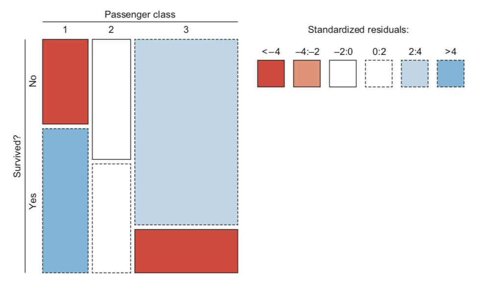
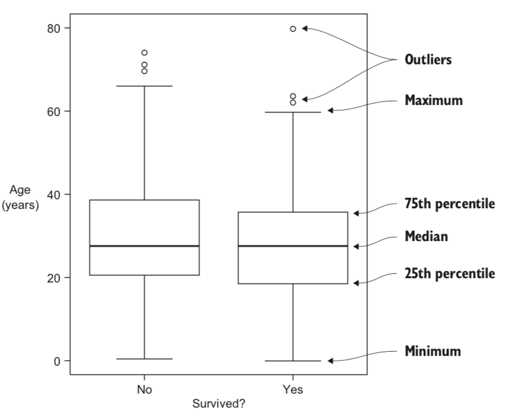
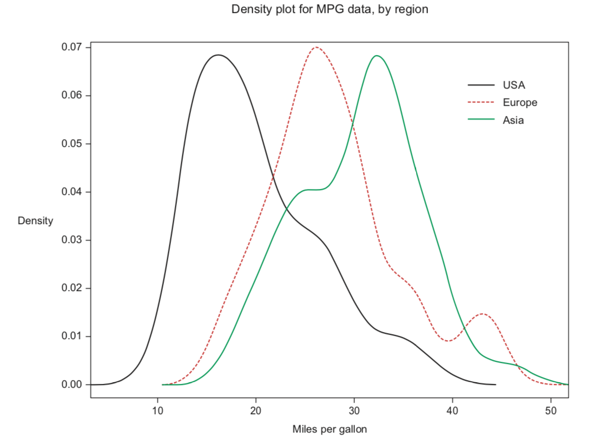
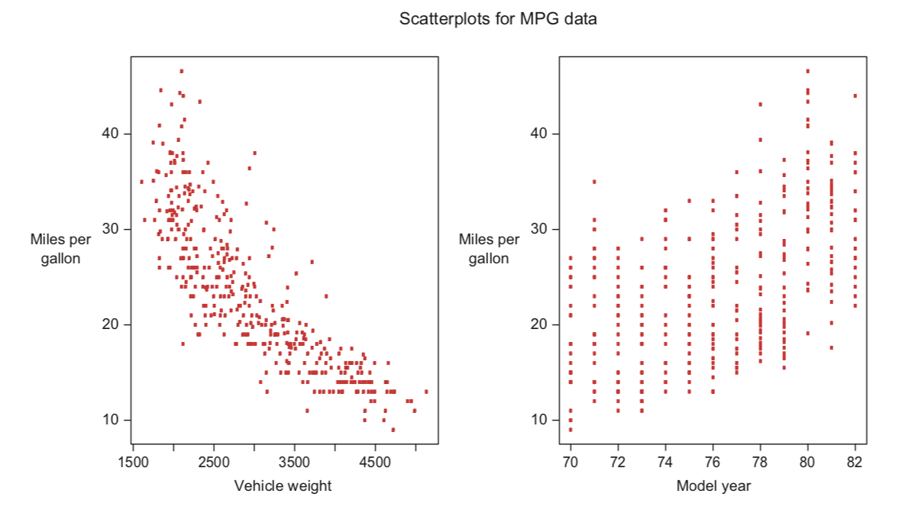

数据可视化
==========

马赛克图(Mosaic plots)
~~~~~~~~~~~~~~~~~~~~~~

1. 如果没有关系，
   则水平分割大体在Y轴的未知（所有的分割线在一条平行直线上）。若存在强关系，则水平分割将会很多。
2. 大负残差（低于期望值）以深色阴影表示，
   大正残差（高于期望）以浅色阴影表示

盒图（Box plots)
~~~~~~~~~~~~~~~~

四分位图(quartile): 最小值，25%，中间值，75%和最大值

| 单个变量的盒图对于分布中心、扩展和偏移十分有用，还可以发生离群值的存在
| 并行显示，可以比较分布情况

当发现分布高度偏移（离群值多），则需要进行简单的转换（如平方根）

密度图（Density plots)
~~~~~~~~~~~~~~~~~~~~~~~~~

| 密度图在可视化单数字多分布式比较容易。
| 需要留意密度图中的次要“起伏”，对他们的研究可保证充分理解他们的性质，并作为特征工程进一步的指导

散点图（Scatter plots)
~~~~~~~~~~~~~~~~~~~~~~

