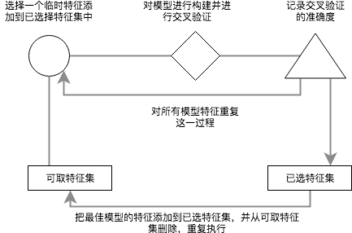
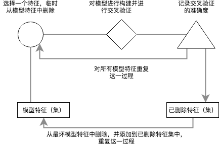
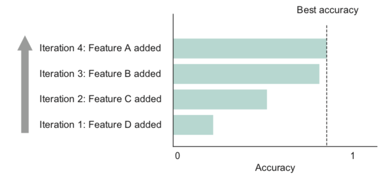

特征选择
============

平衡特征集数量的实用方法
~~~~~~~~~~~~~~~~~~~~~~~~~~

1. 包含所有你认为对目标变量有预测的特征。选择一种模型，如果准确性足够，则停止。
2. 否则，扩大特征集，包含关系较弱的一些。选择另一模型并评估准确性。性能足够，则停止
3. 否则，从扩大的特征集开始，运行特征选择算法来选择最好的、最有预测性的特征集的子集

前向选择
~~~~~~~~

对于较小的特征集，或者需要允许的循环次数较少时（如，模型准确性增长迅速、平稳），在实用中还是很有效的

反向消除
~~~~~~~~

有些算法，对于太小的特征集表现不佳，反向消除是较好的选择

特征选择的可视化方法
~~~~~~~~~~~~~~~~~~~~

画出执行过程的垂直条形图

