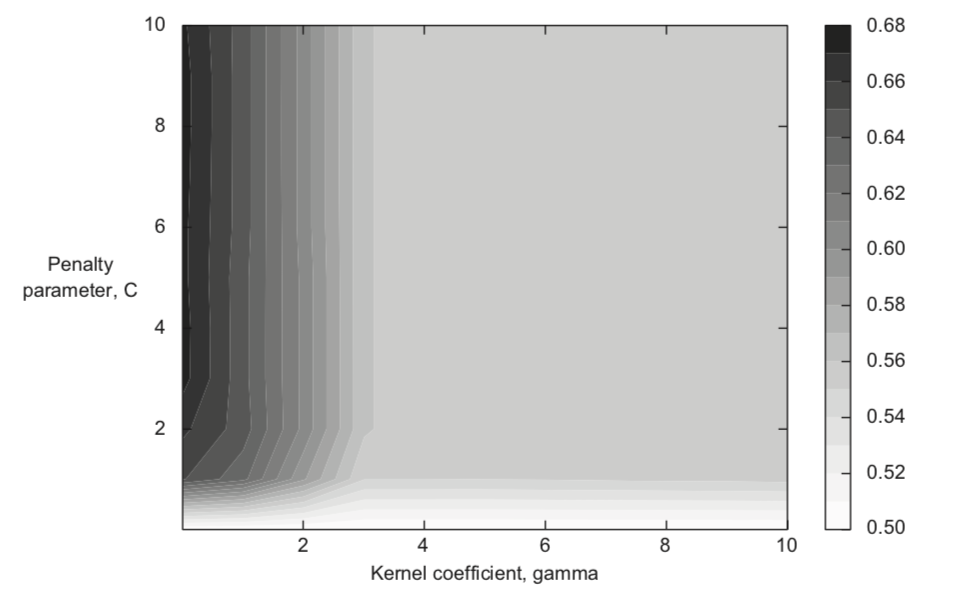

参数调优
========

强力网络搜索(grid search)
~~~~~~~~~~~~~~~~~~~~~~~~~

1. 选择要最大化的评价指标
2. 选择算法
3. 选择需要调整的参数，以及每个参数的一组测试值
4. 定义调整参数数组之间的笛卡尔积作为网络。例如，参数1为[50,100,1000],
   参数2位[10,15]，则网络为[(50,10),(50,15),(100,10),(100,15),(1000,10),(1000,15)]。即以需要调整的参数构成不同坐标轴构成的网格
5. 对每一个组合，进行训练预测计算评价指标
6. 选择指标最大化的参数组合

可以通过搜索网格的等高线来判断和调整网格参数

   4-25 网格等高线

-  最大值在网格的边界， 必须扩大网格重新开始
-  可判断出某个参数高度敏感（如图中gamma）， 需要增加该参数的力度
-  最大值出现在0附件（图中gamma),
   以指数标识(如\ :math:`10^{-4}`\ 、\ :math:`10^{-3}`\ 、\ :math:`10^{-2}`\ 、\ :math:`10^{-1}`)表示更明智
-
