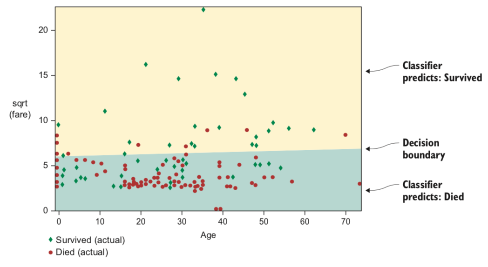
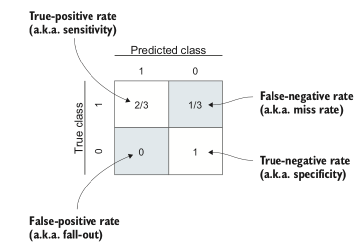
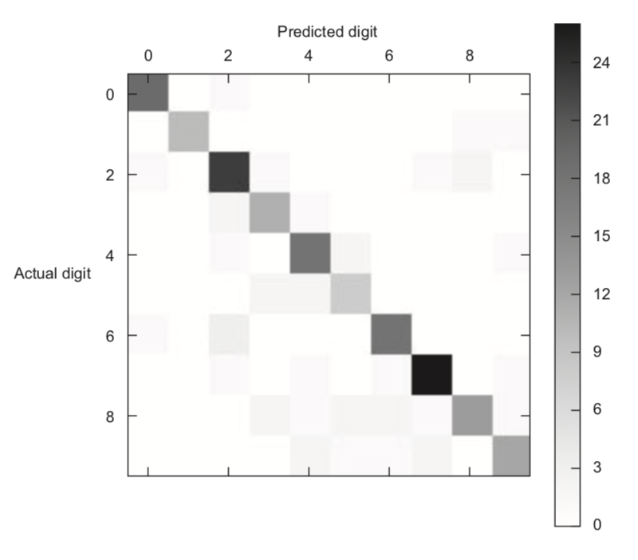
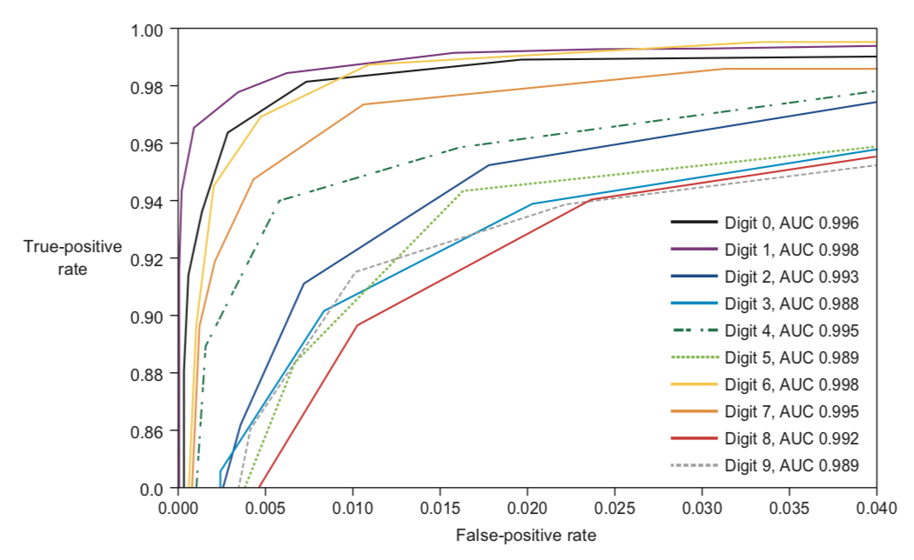

模型评估——分类
==============

通过绘制决策边界对分类器可视化十分有利，给定两个特征就可以绘制出分类边界
|3-7 决策边界|

混淆矩阵（Confusion matrix)
~~~~~~~~~~~~~~~~~~~~~~~~~~~

ROC曲线与AUC指标
~~~~~~~~~~~~~~~~

| **ROC曲线**\ ：FPR(假正率）为X轴，TPR(真正率)为Y轴。由不同阈值为点所构成的曲线
| **AUC**: ROC曲线的线下面积， 越大分类效果越好

通常将AUC直接画到ROC曲线图上

