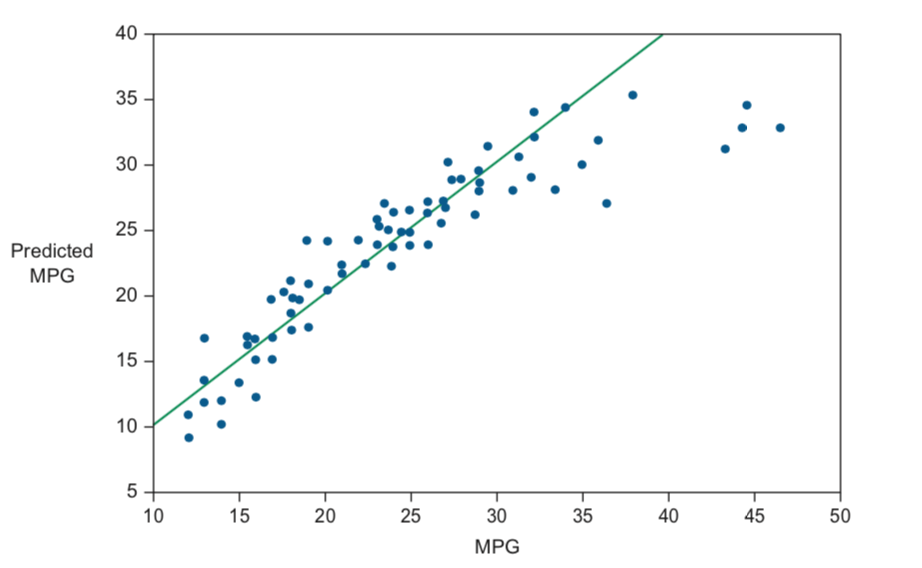
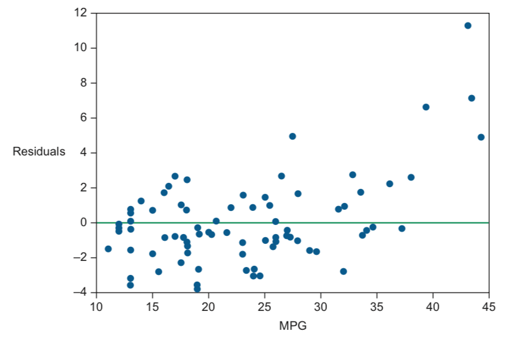

模型评估——回归
==============

画出预测值和真实值的散点图是评估指标的基础。 对角线为最佳模型 |4-22
散点图|

指标
~~~~

RMSE(均方根误差，MSE的平方根)。优点是结果与计算的值有相同的单位，缺点是和问题规模有关，\ **不容易在不同的数据集上进行比较**

:math:`RMSE = \frac{1}{\sqrt{n}}\sqrt{\sum [y_i - f(x_i)]^2} = \sqrt{\frac{散点图中点到模型线的距离的平方和}{测试集数量}}`

:math:`R^2`\ 指标：具有相对性，在0~1之间。模型越好，越接近1

:math:`R^2 = \frac{\sum [y_i - f(x_i)]^2}{\sum [y_i - mean(y)]^2}`

评价指标应尽量与要解决的问题保持一致

检验残差
~~~~~~~~

残差： 预测值与真实值之间的距离。理想的残差值在0附近分布均匀

